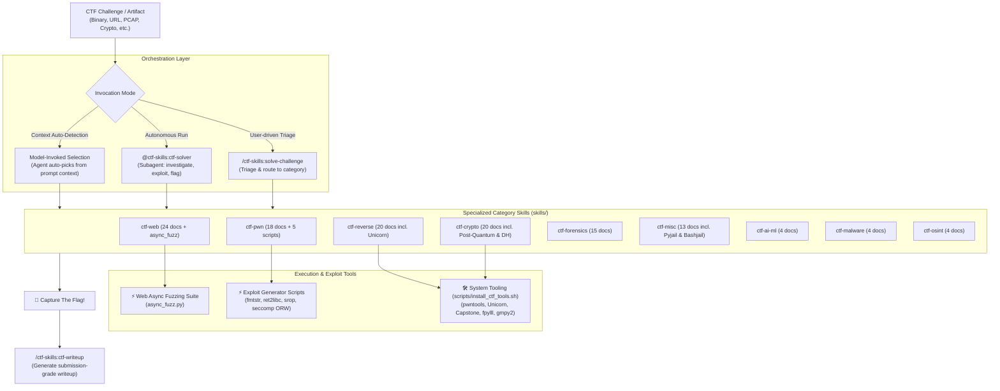

# CTF Skills

[](LICENSE)
[](https://docs.anthropic.com/en/docs/claude-code)
[](#what-inside)
[](#what-inside)
[](#exploit--automation-suite)
[](https://naravid19.github.io/claude-ctf-skills/)

A production-grade **Claude Code plugin** and Agent Skills repository that turns AI coding assistants into competitive Capture The Flag (CTF) security researchers. Built on real competition writeups from CTFTime, it equips agents with **113 modular technique guides**, **6 verified exploit generator scripts**, and an autonomous **`ctf-solver` subagent**.

> **Live Web Catalog**: Explore all skills, techniques, and tools with instant search at [naravid19.github.io/claude-ctf-skills](https://naravid19.github.io/claude-ctf-skills/).  
> **Upstream Attribution**: Core techniques based on [ljagiello/ctf-skills](https://github.com/ljagiello/ctf-skills) (MIT). Repackaged with Claude Code Plugin architecture, self-hosted marketplace, skill-scoped exploit scripts, and an autonomous triage solver subagent.

---

## Architecture & How It Works



### Core Design Principles

1. **Model-Invoked Progressive Disclosure**: You don't need to guess which attack applies. When Claude sees challenge source code or error logs, it selects the appropriate category (`ctf-web`, `ctf-crypto`, `ctf-pwn`) from semantic frontmatter descriptions and loads only the specific technique markdown files it needs.
2. **Self-Contained Skill-Scoped Scripts**: Ready-to-run exploit generators and fuzzers live directly inside `skills/<category>/scripts/` so that each skill is completely portable.
3. **Real Writeups, Not Synthetic Theory**: Every technique is distilled from competitive CTFTime solutions, documenting the exact bypasses, edge cases, and oracles that worked under competition constraints.

---

## Installation (30 Seconds)

### Option 1: Claude Code Marketplace (Recommended)

This repository serves as its own Claude Code marketplace. In your terminal session:

```text
/plugin marketplace add naravid19/claude-ctf-skills
/plugin install ctf-skills@claude-ctf-skills
```

Verify installation:
```text
/plugins
```

### Option 2: Skills Directory Plugin (Auto-loads in all projects)

Clone into your global Claude skills folder:

```bash
git clone https://github.com/naravid19/claude-ctf-skills ~/.claude/skills/ctf-skills
```

Run `/reload-plugins` inside Claude Code to activate immediately without restarting.

### Option 3: Local Testing / Ad-Hoc Execution

Launch Claude Code with the plugin directory explicitly specified:

```bash
claude --plugin-dir /path/to/claude-ctf-skills
```

### Option 4: Other Agents (Agent Skills Specification)

For environments supporting the [Agent Skills standard](https://agentskills.io):

```bash
npx skills add naravid19/claude-ctf-skills
```

---

## What's Inside

### 1. Category Skills (Model-Invoked)

| Skill | Docs | Scripts | Key Techniques & Attack Vectors |
|---|:---:|:---:|---|
| [**ctf-web**](skills/ctf-web/SKILL.md) | 24 | 1 | XSS, SQLi, SSTI, SSRF, XXE, JWT forgery, auth bypass, Port Address Translation (PAT), python-requests toolkit, prototype pollution, Web3/Solidity smart contracts |
| [**ctf-pwn**](skills/ctf-pwn/SKILL.md) | 18 | 5 | Stack overflows, format string exploitation, glibc heap bins (tcache/fastbin/unsorted), ROP/ret2libc, SROP, seccomp sandbox bypass (ORW), kernel exploitation |
| [**ctf-reverse**](skills/ctf-reverse/SKILL.md) | 20 | — | ELF/PE binaries, APK reverse engineering, WebAssembly (WASM), firmware, custom VM bytecode architectures, Unicorn Engine CPU emulation |
| [**ctf-crypto**](skills/ctf-crypto/SKILL.md) | 20 | — | RSA (Coppersmith, Wiener, Bleichenbacher), AES modes, ECC (Pollard rho, invalid curve), lattices (LLL, CVP, LWE), Diffie-Hellman confinement, Poly1305, Post-Quantum, ZKP |
| [**ctf-forensics**](skills/ctf-forensics/SKILL.md) | 15 | — | Memory analysis (Volatility 3), ext4/NTFS disk images, PCAP network streams, steganography, registry forensics, side-channel power/timing, audio & SDR |
| [**ctf-misc**](skills/ctf-misc/SKILL.md) | 13 | — | Pyjail sandbox escapes (audit-hook trampolines), Bashjail escapes (`BASH_ENV` injection), esoteric languages, QR polyglots, z3 constraint solving |
| [**ctf-ai-ml**](skills/ctf-ai-ml/SKILL.md) | 4 | — | Adversarial perturbation (FGSM), prompt injection, LLM jailbreaks, model extraction, training data poisoning, LoRA adapter tampering |
| [**ctf-malware**](skills/ctf-malware/SKILL.md) | 4 | — | PowerShell/VBS deobfuscation, C2 traffic extraction, PE/.NET reversing, shellcode extraction, YARA rule generation, anti-analysis detection |
| [**ctf-osint**](skills/ctf-osint/SKILL.md) | 4 | — | Geolocation, DNS infrastructure, username correlation, reverse image search, Google dorking, Wayback Machine archives |

### 2. Orchestrator Skills (User-Invoked)

| Skill | Invocation Command | Description |
|---|---|---|
| [**solve-challenge**](skills/solve-challenge/SKILL.md) | `/ctf-skills:solve-challenge <target>` | Analyzes an unknown binary, source folder, or URL and routes directly to the right category. |
| [**ctf-writeup**](skills/ctf-writeup/SKILL.md) | `/ctf-skills:ctf-writeup` | Converts the active solving session, commands run, and flag into a clean markdown writeup. |
| [**ctf-solver**](agents/ctf-solver.md) | `@ctf-skills:ctf-solver <target>` | Autonomous custom subagent that triages, inspects, executes payloads, and extracts the flag in its own context. |

---

## Exploit & Automation Suite

The repository includes ready-to-run, parameterized Python helper scripts stored directly inside skill subdirectories:

### Binary Exploitation (`skills/ctf-pwn/scripts/`)

- **[`fmtstr_payload_suite.py`](skills/ctf-pwn/scripts/fmtstr_payload_suite.py)**: Generator suite for format string vulnerabilities. Supports `%p` chain leak generator, arbitrary memory read, GOT overwrites, and single/short byte writes.
- **[`ret2libc_two_stage.py`](skills/ctf-pwn/scripts/ret2libc_two_stage.py)**: Automated two-stage ret2libc exploit using modern pwntools. Leaks libc address via `puts`/`write`, calculates base, and builds second-stage `system("/bin/sh")` payload.
- **[`seccomp_orw_generator.py`](skills/ctf-pwn/scripts/seccomp_orw_generator.py)**: Generates pure x86_64 Open-Read-Write (ORW) shellcode to read flags when `execve` is blocked by seccomp-bpf filters.
- **[`shellcraft_asm.py`](skills/ctf-pwn/scripts/shellcraft_asm.py)**: Lightweight assembly shellcode generator avoiding null bytes and custom forbidden characters.
- **[`srop_execve.py`](skills/ctf-pwn/scripts/srop_execve.py)**: Constructs complete Sigreturn-Oriented Programming (SROP) `SigreturnFrame` payloads for x86_64 binaries with few ROP gadgets.

### Web Fuzzing (`skills/ctf-web/scripts/`)

- **[`async_fuzz.py`](skills/ctf-web/scripts/async_fuzz.py)**: High-performance asynchronous endpoint and parameter fuzzer built with `asyncio` and `aiohttp`. Includes concurrency control, proxy support, regex flag matchers, and HTTP 429 adaptive backoff.

---

## Workflow Examples

### 1. Autonomous End-to-End Solving

Point the subagent at a challenge binary or web URL:

```text
@ctf-skills:ctf-solver ./baby_pwn
```

The agent runs in an isolated context:
1. Gathers file metadata (`file`, `checksec`, dynamic libraries).
2. Decompiles with Ghidra/objdump or tests inputs.
3. Automatically writes and tests an exploit script using `skills/ctf-pwn/scripts/`.
4. Extracts the flag (`flag{...}`) and reports back to you.

### 2. Manual Investigation with Skill Routing

```text
/ctf-skills:solve-challenge https://ctf.example.com/challenges/crypto_rsa
```

Routes immediately to `ctf-crypto`, guides you through factorizations using `scripts/verify_crypto_examples.py`, and suggests attacks (Wiener, Coppersmith, or Boneh-Durfee).

### 3. Generate Submission Writeup

When the challenge is solved:

```text
/ctf-skills:ctf-writeup
```

Emits a structured competition writeup containing challenge metadata, vulnerability analysis, reproduction steps, working exploit script, and key takeaways.

---

## Environment Setup & Tool Installation

Skills operate out of the box with standard Python 3. For competitions requiring specialized binaries and libraries, run the automated environment installer:

```bash
bash scripts/install_ctf_tools.sh all
```

### Modular Installation Groups

| Command | Tools Installed |
|---|---|
| `bash scripts/install_ctf_tools.sh python` | `pwntools`, `z3-solver`, `cryptography`, `pycryptodome`, `gmpy2`, `sympy`, `fpylll`, `requests`, `aiohttp`, `unicorn`, `capstone`, `ropper` |
| `bash scripts/install_ctf_tools.sh apt` | `gdb`, `gdbserver`, `checksec`, `nasm`, `binwalk`, `exiftool`, `tshark`, `radare2` |
| `bash scripts/install_ctf_tools.sh pat` | Clones external wordlists from [PayloadsAllTheThings](https://github.com/swisskyrepo/PayloadsAllTheThings) |
| `bash scripts/install_ctf_tools.sh verify` | Runs dry-run checks and validates CLI availability |

Installation logs and state are saved to `~/.ctf-tools/`.

---

## Testing & Quality Assurance

This repository maintains strict CI verification across all skills, scripts, and frontmatter:

```bash
# Run complete test suite (103 unit tests)
python -m pytest tests/ -v

# Verify skill frontmatter validity and required metadata
python -m pytest tests/test_skill_frontmatter.py -v

# Validate crypto snippet math vectors
python -m pytest tests/test_crypto_snippets.py -v

# Validate all blob links in GitHub Pages catalog resolve
python -m pytest tests/test_catalog_links.py -v

# Syntax-check all Python crypto code blocks
python scripts/verify_crypto_examples.py

# Run security auditor across skills to check for credential leaks
python scripts/skill_security_auditor.py skills/ctf-web
```

---

## Generating the Web Catalog

The static catalog is generated from skill frontmatter into `_site/`:

```bash
python scripts/generate_catalog.py
```

GitHub Actions automatically builds and deploys `_site/` to [GitHub Pages](https://naravid19.github.io/claude-ctf-skills/) on every push to `main`.

---

## Contributing

See [CONTRIBUTING.md](CONTRIBUTING.md) for detailed guidelines on formatting technique files, submitting pull requests, and passing the security audit.

## Responsible Use & Security

This repository documents offensive cybersecurity techniques exclusively for **authorized CTF competitions, educational purposes, and defensive security research**. All contributors must adhere to [SECURITY.md](SECURITY.md). Never include live targets, malicious infrastructure, or real user credentials.

---

## License

[MIT](LICENSE) © 2026 Narawit. Original library © [Lukasz Jagiello](https://github.com/ljagiello).
